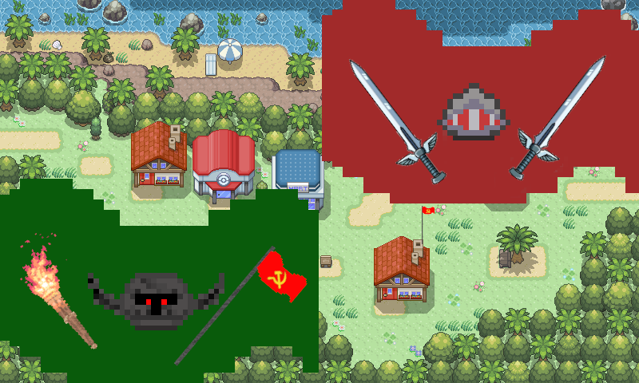

# Java-Pixel-Game

+ This **Java Pixel Game** has been programmed in **Java** and is a current **work-in-progress**!

## Download
+ If you wish to download this game, you can do this at [Releases](https://github.com/thevicraft/java-pixel-game/releases) tab.

## Important:
+ The Game is a current **work-in-progress**, surely there are **bugs**, so please **report** them [here](https://github.com/thevicraft/java-pixel-game/issues)
+ Keep in mind, that this game makes use of Java2D graphics, therefore the **performance is extremely poor**. Soon I will change to **OpenGL graphics**!

## Images

+ 
+ 
+ *Coming soon ...*

### License
+ It is **forbidden** to **spread** this game under another name than the original author!
+ If you wish to share the game, **credit the author** or link to this [github respository](https://github.com/thevicraft/java-pixel-game)!
+ It is **not allowed** to **manipulate**, **share**, or **sell** in an illegal way:
    + the entire game
    + any game parts
    + game textures
    + game audio files
    + any game resources

## Author
This game has been fully developed by thevicraft.
+ **Discord**: [here](https://discord.com/invite/pXDxjKB7q3)
+ **Youtube**: [here](https://www.youtube.com/channel/UCjiP-NZ-BqZiH9IlEW-shLw)
+ **SimpleCalculator** (other coding project): [SimpleCalculator](https://github.com/thevicraft/Calculator)

## Library Reference

+ **JOGL** (*OpenGL library for Java*): [here](https://jogamp.org/jogl/www/)
+ **paulscode's 3D sound library**: [here](http://www.paulscode.com/forum/index.php?topic=4.0)
+ **json-simple** (*JSON Parser for Java*): [here](https://github.com/fangyidong/json-simple)

## Used libraries

+ *CodecIBXM.jar*
+ *CodecJOgg.jar*
+ *CodecJOrbis.jar*
+ *CodecJSpeex.jar*
+ *CodecWav.jar*
+ *gluegen-rt.jar*
+ *gluegen-rt-natives-linux-amd64.jar*
+ *gluegen-rt-natives-linux-armv6.jar*
+ *gluegen-rt-natives-linux-armv6hf.jar*
+ *gluegen-rt-natives-linux-i586.jar*
+ *gluegen-rt-natives-macosx-universal.jar*
+ *gluegen-rt-natives-solaris-amd64.jar*
+ *gluegen-rt-natives-solaris-i586.jar*
+ *gluegen-rt-natives-windows-amd64.jar*
+ *gluegen-rt-natives-windows-i586.jar*
+ *jogl.all.jar*
+ *jogl-all.jar*
+ *jogl-all-natives-linux-amd64.jar*
+ *jogl-all-natives-linux-armv6.jar*
+ *jogl-all-natives-linux-armv6hf.jar*
+ *jogl-all-natives-linux-i586.jar*
+ *jogl-all-natives-macosx-universal.jar*
+ *jogl-all-natives-solaris-amd64.jar*
+ *jogl-all-natives-solaris-i586.jar*
+ *jogl-all-natives-windows-amd64.jar*
+ *jogl-all-natives-windows-i586.jar*
+ *json-simple-1.1.1.jar*
+ *LibraryJavaSound.jar*
+ *LibraryJOAL.jar*
+ *LibraryLWJGLOpenAL.jar*
+ *SoundSystemJPCT.jar*
+ *TimingFramework-0.55.jar*

+ Credit for main menu pixelart background image map: [here](https://www.deviantart.com/chaoticcherrycake/art/Map-005-375439465)
